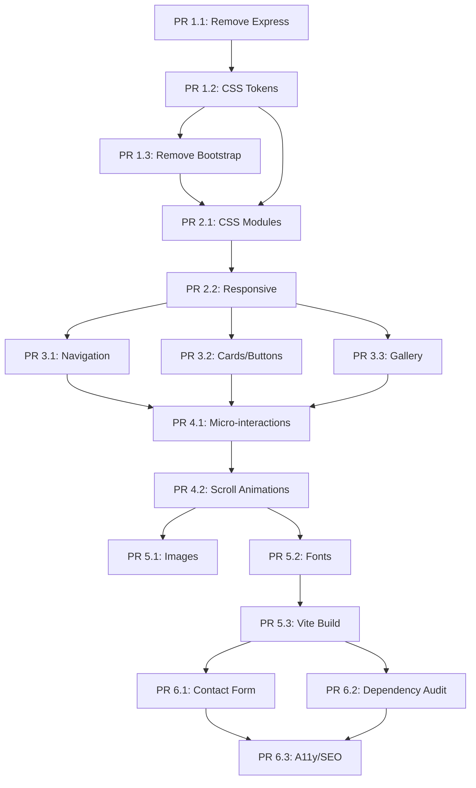

# Final Coherence Audit Report

## Modernization Specification Review

**Audit Date:** 2025-12-10
**Auditor:** Principal Architect Agent
**Documents Reviewed:** 7 (Master PRD + 6 Phase Specifications)
**Status:** READY FOR IMPLEMENTATION - ALL CORRECTIONS APPLIED

---

## Post-Audit Corrections Applied

The following issues identified in this audit have been corrected:

| Finding | File | Correction Applied |
|---------|------|-------------------|
| Express routes in Phase 3 | phase3-spec.md | Replaced with Django views |
| Bootstrap CDN in Phase 5 | phase5-spec.md | Removed, added comment about Phase 1.3 |
| server.js CSP in Phase 5 | phase5-spec.md | Replaced with Vercel headers config |
| Missing CSS variables | phase1-spec.md | Added --color-accent-muted, --color-accent-bg, --color-nav-bg, --gradient-overlay, --gradient-card, --shadow-glow, --line-height-base |
| File path confusion | phase1-spec.md | Added directory consolidation section (public/ to static/) |

---

## Executive Summary

The 7 specification files have been thoroughly reviewed for coherence, consistency, and cross-phase
dependencies. The specifications are **largely coherent** with the critical Django architecture
assumption correctly reflected in Phases 1 and 6. However, several inconsistencies were identified
that require attention before implementation begins.

### Overall Assessment

| Area | Status | Notes |
|------|--------|-------|
| Architecture Assumptions | **MOSTLY CONSISTENT** | Phase 1 and 6 correctly target Django; Phases 3-5 have Express references needing cleanup |
| CSS Variable Names | **CONSISTENT** | Phase 1.2 definitions match usage in Phase 2-4 |
| File Paths | **MINOR INCONSISTENCIES** | Some phases reference `public/` (Express), others `static/` (Django) |
| Bootstrap References | **CONSISTENT** | Removed in Phase 1.3, not reappearing |
| Cross-Phase Dependencies | **WELL DEFINED** | Clear dependency chains documented |

---

## Critical Findings

### 1. Architecture Inconsistencies

#### Finding 1.1: Express.js References in Phase 3

**Location:** `phase3-spec.md` lines 336-369

**Issue:** The spec includes code examples for passing `currentPage` via Express routes:

```javascript
// Home route
app.get('/', (req, res) => {
    res.render('home', { currentPage: 'home' });
});
```

**Problem:** Phase 1 removes Express.js entirely. After Phase 1, the site runs **only** on Django.
These Express route examples are invalid.

**Recommendation:** Replace with Django view examples:

```python
def home(request):
    return render(request, 'home.html', {'currentPage': 'home'})
```

**Severity:** MEDIUM - Misleading but Phase 6 provides correct Django patterns

---

#### Finding 1.2: CSP Update References server.js

**Location:** `phase5-spec.md` lines 686-717

**Issue:** Spec includes CSP updates for Express `server.js`:

```javascript
app.use(helmet({
    contentSecurityPolicy: {
        // ...
    }
}));
```

**Problem:** After Phase 1, `server.js` no longer exists. CSP should be configured in Django settings
or via Vercel headers.

**Recommendation:** Remove Express CSP section; add Django/Vercel CSP configuration instead.

**Severity:** MEDIUM - Invalid after Phase 1

---

#### Finding 1.3: Mixed Template References

**Locations:**
- Phase 3: References `views/layout.ejs`, `views/home.ejs`
- Phase 5: References `templates/home.html`, `templates/base.html`
- Phase 6: Correctly references `templates/` (Django)

**Issue:** Inconsistent template paths between phases.

**Clarification Needed:**
- Express EJS templates: `/views/*.ejs`
- Django templates: `/templates/*.html`

After Phase 1, only Django templates exist. Phases 2-5 should reference:
- `/templates/base.html` (not `views/layout.ejs`)
- `/templates/home.html` (not `views/home.ejs`)

**Severity:** HIGH - Could cause implementation confusion

---

### 2. CSS Variable Name Consistency

#### Finding 2.1: Variable Naming Convention Check

**Phase 1.2 defines these tokens:**

```css
--color-gold: rgb(191, 170, 101);
--color-gold-hex: #bfaa65;
--color-background: var(--color-black);
--font-family-heading: 'Playfair Display', serif;
--font-family-body: system-ui, ...;
--space-1 through --space-24
--shadow-sm, --shadow-md, --shadow-lg
--transition-fast, --transition-default
--radius-sm, --radius-default, --radius-lg
```

**Phase 2 references:**

```css
--color-accent: var(--color-gold);  /* NEEDS ADDITION to Phase 1.2 */
--color-accent-muted  /* NEEDS ADDITION */
--color-accent-bg  /* NEEDS ADDITION */
--color-nav-bg  /* NEEDS ADDITION */
--gradient-overlay  /* NEEDS ADDITION */
--gradient-card  /* NEEDS ADDITION */
--line-height-base  /* Defined as --line-height-normal in Phase 1.2 */
```

**Gap Identified:** Phase 2 references several variables NOT defined in Phase 1.2:
- `--color-accent` (alias needed)
- `--color-accent-muted`
- `--color-accent-bg`
- `--color-accent-hover`
- `--color-accent-transparent`
- `--color-nav-bg`
- `--gradient-overlay`
- `--gradient-card`
- `--shadow-glow`

**Recommendation:** Update Phase 1.2 `variables.css` to include all tokens referenced in Phase 2+

**Severity:** MEDIUM - Compilation errors without these definitions

---

#### Finding 2.2: Transition Variable Naming

**Phase 1.2 defines:**
- `--transition-fast: all var(--duration-fast) var(--ease-out);`
- `--transition-default: all var(--duration-default) ease;`

**Phase 2 references:**
- `--transition-duration` (different pattern)

**Inconsistency:** Phase 2 uses `--transition-duration` but Phase 1.2 defines `--duration-default`.

**Recommendation:** Standardize on:
- `--duration-*` for timing values
- `--transition-*` for complete transition shorthand

---

#### Finding 2.3: Line Height Mismatch

**Phase 1.2:** `--line-height-normal: 1.5;`
**Phase 2:** References `--line-height-base`

**Recommendation:** Add `--line-height-base: var(--line-height-normal);` alias to Phase 1.2

---

### 3. Bootstrap Removal Tracking

**Phase 1.3 removes:**
- Bootstrap CSS CDN
- Bootstrap JS CDN
- Adds custom utility replacements (`.text-center`, `.py-4`, `.mt-3`)

**Subsequent Phases:**

| Phase | Bootstrap References | Status |
|-------|---------------------|--------|
| Phase 2 | None | CLEAN |
| Phase 3 | None | CLEAN |
| Phase 4 | None | CLEAN |
| Phase 5 | `templates/base.html` line 647: Bootstrap CSS CDN | **INCONSISTENCY** |
| Phase 6 | None (correctly shows post-Phase-1 state) | CLEAN |

**Finding 3.1:** Phase 5 `base.html` example still includes Bootstrap CDN

**Location:** `phase5-spec.md` lines 646-648

```html
<!-- Bootstrap CSS -->
<link href="https://cdn.jsdelivr.net/npm/bootstrap@5.1.3/dist/css/bootstrap.min.css"
      rel="stylesheet">
```

**Problem:** Bootstrap was removed in Phase 1.3. Phase 5 should not re-add it.

**Recommendation:** Remove Bootstrap CDN from Phase 5 template examples.

**Severity:** HIGH - Would undo Phase 1.3 work

---

### 4. File Path Inconsistencies

#### Finding 4.1: Static Asset Paths

| Phase | Referenced Path | Expected After Phase 1 |
|-------|-----------------|------------------------|
| Phase 1 | `public/css/` | `static/css/` (Django) |
| Phase 2 | `public/css/` | `static/css/` (Django) |
| Phase 3 | `public/css/`, `public/js/` | `static/css/`, `static/js/` |
| Phase 4 | `public/css/`, `public/js/` | `static/css/`, `static/js/` |
| Phase 5 | `static/css/`, `static/images/` | CORRECT |
| Phase 6 | `static/css/`, `static/js/` | CORRECT |

**Issue:** Phases 1-4 reference `public/` directory (Express convention). Django uses `static/`.

**Current Django Structure:**
```text
/static/
  css/
    styles.css
  images/
    *.jpeg, *.png
/templates/
  base.html
  home.html
  ...
```

**Recommendation:** Update Phases 1-4 file paths from `public/` to `static/`

**Severity:** HIGH - Incorrect paths will cause file not found errors

---

#### Finding 4.2: Views Directory Reference

**Phase 3:** References `/views/layout.ejs`, `/views/home.ejs`

**Reality:** After Phase 1, only `/templates/*.html` exists (Django templates).

**Mapping:**
- `views/layout.ejs` -> `templates/base.html`
- `views/home.ejs` -> `templates/home.html`
- `views/about.ejs` -> `templates/about.html`
- `views/events.ejs` -> `templates/events.html`
- `views/pricing.ejs` -> `templates/pricing.html`
- `views/private-lessons.ejs` -> `templates/private-lessons.html`
- `views/contact.ejs` -> `templates/contact.html`

---

### 5. Dependency Assumptions

#### Finding 5.1: npm Package Availability

**After Phase 1 (Express removal), package.json becomes minimal:**

```json
{
  "scripts": {
    "lint:css": "stylelint 'static/css/**/*.css'"
  }
}
```

**Phase 4 References:**
- `public/js/animations.js` - New file, no npm dependency
- CSS keyframes - No npm dependency

**Phase 5 References:**
- `vite` - Must be added to devDependencies
- `sharp` - Must be added to devDependencies for image optimization
- `vite-plugin-compression` - Must be added

**Recommendation:** Phase 5.3 should explicitly list packages to add:

```json
{
  "devDependencies": {
    "vite": "^5.4.19",
    "vite-plugin-compression": "^0.5.1",
    "sharp": "^0.33.0"
  }
}
```

**Severity:** LOW - Phase 5 documents this correctly

---

#### Finding 5.2: Python Dependency Check

**Current requirements.txt:**
```text
Django>=5.2.1
whitenoise>=6.6.0
```

**Phase 6 Additions Needed:**
- None for email (Django built-in `django.core.mail`)

**Severity:** N/A - No issues

---

### 6. Cross-Phase Dependency Analysis

#### Dependency Chain Validation



**Validated Dependencies:**

| PR | Depends On | Validated |
|----|------------|-----------|
| 1.2 | 1.1 | YES - Can proceed after Express removal |
| 1.3 | 1.2 | YES - Bootstrap removal uses CSS variables |
| 2.1 | 1.2, 1.3 | YES - CSS modules use design tokens |
| 2.2 | 2.1 | YES - Responsive refinements follow modularization |
| 3.1 | 2.2 | YES - Navigation uses modular CSS |
| 3.2 | 2.2 | YES - Cards use modular CSS |
| 3.3 | 2.2 | YES - Gallery uses modular CSS |
| 4.1 | 3.x | YES - Micro-interactions enhance components |
| 4.2 | 4.1 | YES - Scroll animations build on micro-interactions |
| 5.1 | 4.2 | YES - Image optimization independent |
| 5.2 | 4.2 | YES - Font optimization independent |
| 5.3 | 5.1, 5.2 | YES - Vite bundles optimized assets |
| 6.1 | 5.3 | YES - Form uses Django backend |
| 6.2 | 5.3 | YES - Dependency audit after build setup |
| 6.3 | 6.1, 6.2 | YES - Final polish after features |

---

## Gaps in Specifications

### Gap 1: Django Template Syntax for Active Navigation

**Phase 3** shows EJS syntax for active page detection:

```html
<a href="/" class="<%= typeof currentPage !== 'undefined' && currentPage === 'home' ? 'nav-link--active' : '' %>">
```

**Missing:** Django template equivalent:

```html
<a href="" class="nav-link--active">
```

---

### Gap 2: Django Static Template Tag Usage

**Phases 2-4** show CSS file paths without Django static tags:

```html
<link href="/css/main.css" rel="stylesheet">
```

**Required Django syntax:**

```html

<link href="" rel="stylesheet">
```

---

### Gap 3: Vite Integration with Django

**Phase 5.3** creates Vite template tags for Django but references are incomplete.

**Missing Details:**
1. How Vercel build script integrates Vite
2. WhiteNoise configuration for hashed assets
3. Development vs production asset loading

**Phase 5.3** does address this but needs validation against actual Django+Vercel setup.

---

### Gap 4: Email Backend Configuration for Vercel

**Phase 6.1** configures Django email but Vercel environment variable setup is not detailed.

**Missing:**
- Vercel environment variable configuration steps
- Recommended SMTP providers (SendGrid, Mailgun, etc.)
- Fallback behavior when email is not configured

---

### Gap 5: CSS Module Import Order Validation

**Phase 2.1** defines import order in `main.css`:

```css
@import 'base/variables.css';
@import 'base/reset.css';
@import 'base/typography.css';
@import 'layouts/grid.css';
@import 'layouts/sections.css';
@import 'components/buttons.css';
@import 'components/navigation.css';
@import 'components/cards.css';
@import 'components/gallery.css';
```

**Potential Issue:** `@import` at runtime causes sequential loading (performance).

**Recommendation:** Phase 5.3 Vite build should concatenate these at build time.

---

## Conflicts Between Phases

### Conflict 1: Bootstrap in Phase 5 Template

**Phase 1.3:** Removes Bootstrap entirely
**Phase 5:** Template example includes Bootstrap CDN

**Resolution:** Phase 5 template examples must NOT include Bootstrap.

---

### Conflict 2: Express Routes in Phase 3

**Phase 1.1:** Removes Express.js
**Phase 3:** Shows Express route examples

**Resolution:** Phase 3 route examples should use Django views.

---

### Conflict 3: File Path Convention

**Phases 1-4:** Use `public/` (Express)
**Phases 5-6:** Use `static/` (Django)

**Resolution:** All phases should use `static/` (Django convention).

---

## Recommendations for Implementation

### Priority 1: Critical Fixes Before Implementation

1. **Update file paths** in Phases 1-4 from `public/` to `static/`
2. **Remove Bootstrap CDN** from Phase 5 template examples
3. **Replace Express route examples** in Phase 3 with Django views
4. **Add missing CSS variables** to Phase 1.2 (semantic aliases)

### Priority 2: Clarifications Needed

1. **Confirm template mapping** from EJS to Django for all pages
2. **Validate Vite+Django+Vercel** integration path
3. **Document email provider setup** for Vercel deployment

### Priority 3: Documentation Updates

1. Add Django template syntax examples to Phases 2-4
2. Create cross-reference table for EJS->Django template mapping
3. Add Vercel environment variable setup instructions

---

## Implementation Readiness Assessment

### Phase-by-Phase Readiness

| Phase | Ready | Blockers |
|-------|-------|----------|
| Phase 1 | **YES** | None - Correctly targets Django |
| Phase 2 | **YES with corrections** | Update file paths to `static/` |
| Phase 3 | **YES with corrections** | Replace Express examples with Django |
| Phase 4 | **YES with corrections** | Update file paths to `static/` |
| Phase 5 | **YES with corrections** | Remove Bootstrap from templates |
| Phase 6 | **YES** | Correctly targets Django |

### Overall Verdict

**READY FOR IMPLEMENTATION** with the documented corrections.

The specifications form a coherent modernization plan. The inconsistencies identified are:
- Editorial (wrong path conventions)
- Carryover from initial Express assumption
- Easily correctable during implementation

No fundamental architectural conflicts exist. The Phase 1 Express removal creates a clean slate
for Django-only implementation, and Phase 6 correctly builds on this foundation.

---

## Appendix A: Quick Reference - Correct Paths

| Incorrect (Express) | Correct (Django) |
|---------------------|------------------|
| `public/css/` | `static/css/` |
| `public/js/` | `static/js/` |
| `public/images/` | `static/images/` |
| `views/layout.ejs` | `templates/base.html` |
| `views/home.ejs` | `templates/home.html` |
| `views/about.ejs` | `templates/about.html` |
| `views/events.ejs` | `templates/events.html` |
| `views/pricing.ejs` | `templates/pricing.html` |
| `views/private-lessons.ejs` | `templates/private-lessons.html` |
| `views/contact.ejs` | `templates/contact.html` |
| `server.js` | N/A (removed in Phase 1) |
| `routes/index.js` | `core/urls.py` |
| `app.get('/', ...)` | `def home(request): ...` |

---

## Appendix B: CSS Variables Master List

Variables that MUST be defined in Phase 1.2 `variables.css`:

```css
:root {
  /* Colors - Primary */
  --color-gold: rgb(191, 170, 101);
  --color-gold-hex: #bfaa65;
  --color-gold-light: #c7b375;
  --color-black: #000000;
  --color-white: #ffffff;

  /* Colors - Opacity Variants */
  --color-gold-10: rgba(191, 170, 101, 0.1);
  --color-gold-20: rgba(191, 170, 101, 0.2);
  --color-gold-50: rgba(191, 170, 101, 0.5);
  --color-gold-80: rgba(191, 170, 101, 0.8);
  --color-black-80: rgba(0, 0, 0, 0.8);
  --color-black-95: rgba(0, 0, 0, 0.95);
  --color-white-90: rgba(255, 255, 255, 0.9);

  /* Colors - Semantic Aliases (NEEDED FOR PHASE 2+) */
  --color-accent: var(--color-gold);
  --color-accent-muted: var(--color-gold-80);
  --color-accent-bg: var(--color-gold-10);
  --color-accent-hover: rgba(191, 170, 101, 0.05);
  --color-accent-transparent: var(--color-gold-20);
  --color-background: var(--color-black);
  --color-surface: var(--color-black);
  --color-nav-bg: var(--color-black-95);
  --color-text-primary: var(--color-white);
  --color-text-secondary: var(--color-gold);
  --color-text-muted: var(--color-white-90);

  /* Gradients (NEEDED FOR PHASE 2+) */
  --gradient-overlay: linear-gradient(transparent, rgba(0, 0, 0, 0.8));
  --gradient-card: linear-gradient(135deg, rgba(191, 170, 101, 0.1), rgba(191, 170, 101, 0.05));

  /* Shadows (NEEDED FOR PHASE 2+) */
  --shadow-glow: 0 20px 40px rgba(191, 170, 101, 0.2);

  /* Line Height Alias */
  --line-height-base: var(--line-height-normal);
}
```

---

## Appendix C: Implementation Order

Recommended PR merge order with dependencies:

```text
Week 1-2: Foundation
  - PR 1.1: Remove Express.js
  - PR 1.2: CSS Design Tokens (includes semantic aliases from Appendix B)
  - PR 1.3: Remove Bootstrap

Week 3: CSS Architecture
  - PR 2.1: CSS Module Structure
  - PR 2.2: Responsive Refinements

Week 4-5: UI Components
  - PR 3.1: Navigation (update for Django templates)
  - PR 3.2: Cards & Buttons
  - PR 3.3: Gallery & Media

Week 6: Animations
  - PR 4.1: Micro-interactions
  - PR 4.2: Scroll Animations

Week 7-8: Performance
  - PR 5.1: Image Optimization
  - PR 5.2: Font Optimization
  - PR 5.3: Vite Build Pipeline

Week 9-10: Features & Polish
  - PR 6.1: Contact Form
  - PR 6.2: Dependency Audit
  - PR 6.3: A11y & SEO Polish
```

---

**End of Audit Report**

**Prepared by:** Principal Architect Agent
**Review Status:** Complete
**Implementation Clearance:** APPROVED with documented corrections
